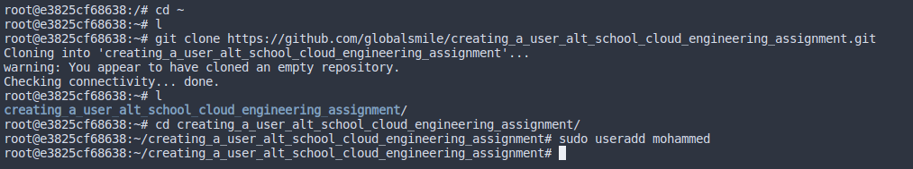
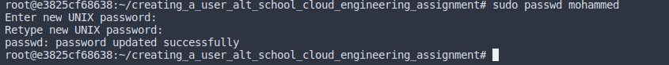
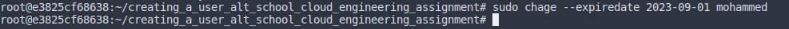
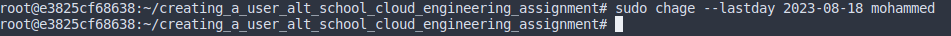
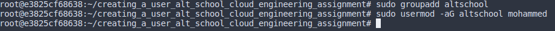
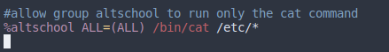
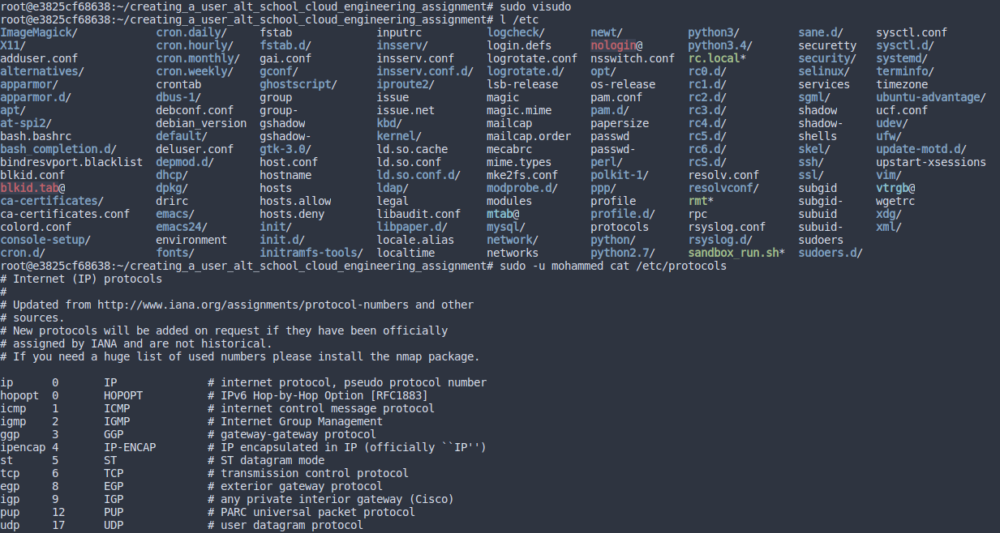
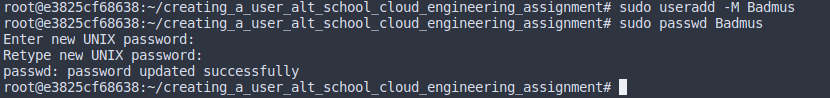

# Create a user

# Set expiry date (2 weeks)

# Prompt the user to change there password on login

# Attach the user to a group called altschool

# Allow altschool group to be able to run only cat command on /etc/

# Create another user. make sure that this user doesn't have a home directory

